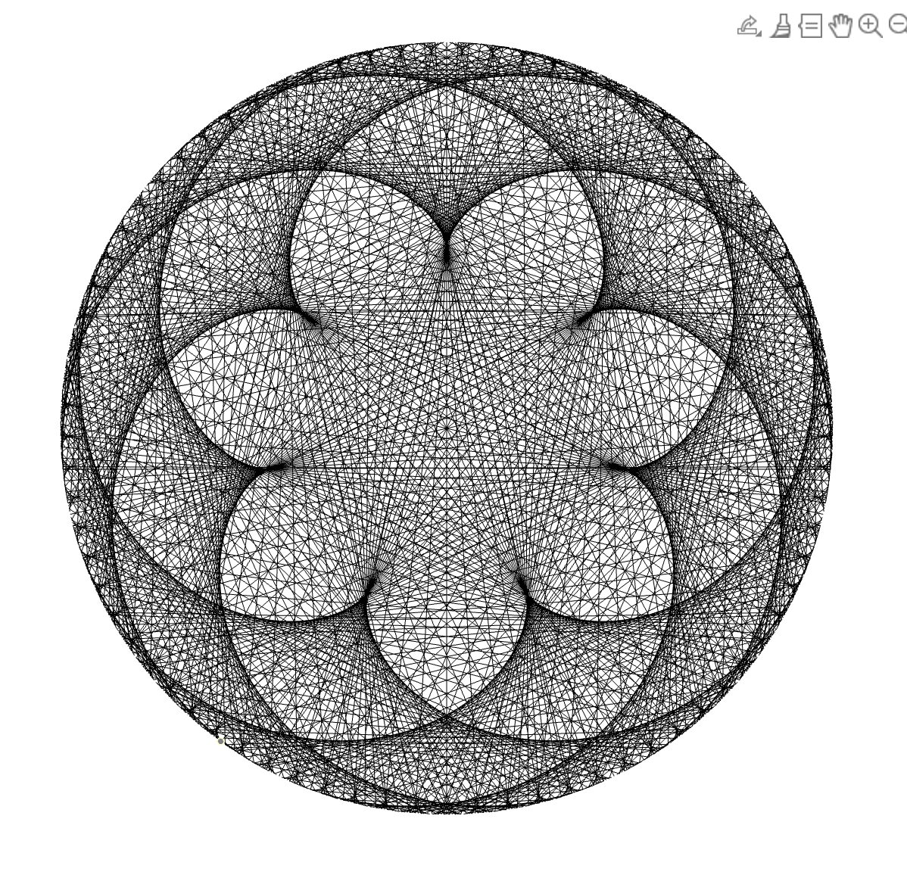

# Rosaces

By representing multiplications on a circle, and joining the multiplier
 by the answer with a modulo reprensenting the circle and moving then,
 hypnorizing displays emerge.

`rosaces.m` is a script displaying a single image.

`make_avi.m` is a script creating an avi file by displaying a range of multipliers.

`TablesMultiplication.m` is an real-time interactive display where one can change the parameters.

Here is a demo of an avi movie:
https://www.youtube.com/embed/FccXPv1TKzo

[This Youtube video](https://www.youtube.com/watch?v=-X49VQgi86E) explains in great detail and fun the idea. 

